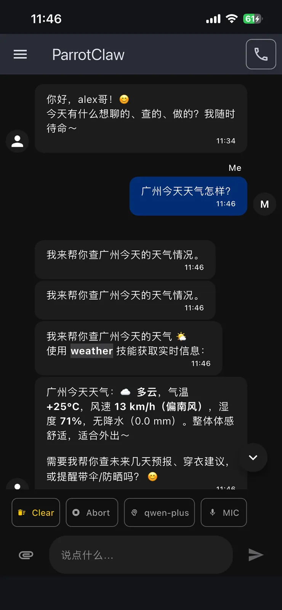

<p align="center">

</p>
<h1 align="center" style="margin: 30px 0 30px; font-weight: bold;">ParrotClaw</h1>
<h4 align="center">An AI digital employee for one-person companies and content creators</h4>
<p align="center">
 <a href="https://parrot.geetion.com"></a>
 <a href="https://github.com/cjl84914/parrot_claw"></a>
 <a href="https://github.com/cjl84914/parrot_claw/blob/main/LICENSE"></a>
</p>

<p align="center"><strong>English</strong> | <a href="README.md">中文</a></p>

> Self-hosted · Conversational
> Open source, forever


## Screenshots

<div align="center">
  
  &nbsp;&nbsp;&nbsp;
  
</div>

---

## What is this

**ParrotClaw** is a digital employee solution.

Just open the app and tell it what you need — in plain conversation, the way you'd chat with a person — and it gets the work done.

**What it covers:**
- **Meeting notes assistant** — feed it a recording, get the minutes
- **Knowledge Q&A assistant** — ask questions against your company's knowledge base
- **Content creation** — text, images, video, audio

👉 [About ParrotClaw](docs/docs/about.md)

> 📖 The project ships with a VitePress documentation site. Preview it locally with `cd docs && npm run docs:dev`

---

## Getting started

[Flutter](https://docs.flutter.dev/get-started/install) is required (`3.47.1`).

```bash
git clone https://github.com/cjl84914/parrot_claw.git
cd parrot_claw
flutter pub get
flutter run
```

---

## Usage examples

Open the app and say something in the chat:

> "Hello"

The agent will answer. Start with the simplest conversation, then let it do more:

> "Turn the meeting recording I just made into minutes"

> "Write an article and publish it to Juejin"

> "Generate a promo image for my product"

📖 For complete, walk-through tutorials (article writing, meeting notes, publishing to Juejin, audio/video processing, code explanation), see [Use cases](docs/docs/use-cases.md)

---

## Architecture

```
ParrotClaw App (Flutter UI layer)
         ↕
     OpenClaw (Agent orchestration hub)
         ↕
    ComfyUI / TTS / other tools
```

- **ParrotClaw App** — the UI layer, with built-in offline speech recognition (ASR), a real-time talking digital human, and more
- **OpenClaw** — the agent orchestration hub that wires up the toolchain
- **Toolchain** — image generation, video generation, music generation, speech synthesis, knowledge base, and more

---

## Current version

- App version: `1.0.6`
- Flutter SDK: `3.47.1`

## Roadmap

- [x] Chat with an agent
- [x] Knowledge Q&A assistant
- [x] Text-to-speech (TTS)
- [x] Digital human integration (Live2D)
- [x] Text-to-image / image-to-image
- [x] Music generation (AceStep text-to-song)
- [x] Meeting notes assistant (recording → minutes)
- [x] Open sourced on GitHub
- [x] GitHub Actions
- [x] Windows build
- [x] Scan-to-clone server
- [x] Session management
- [x] Compatible with official QR pairing
- [x] Skill management
- [ ] Scheduled tasks
- [ ] Agent configuration
- [ ] English README + DOCS
- [ ] Text-to-video / image-to-video
- [ ] Digital human examples
- [ ] FaceFusion examples

---

## Tech stack

- **Flutter** — cross-platform app (macOS / iOS / Android / Windows)
- **OpenClaw** — AI agent framework
- **ComfyUI** — image / video / music generation
- **FFmpeg** — video / audio processing
- **Live2D / DUIX** — digital human
- **Sherpa-onnx** — offline speech recognition

---

## License

[MIT](LICENSE)

## Acknowledgements

ParrotClaw stands on the shoulders of these excellent open-source projects. Our sincere thanks to:

- [Flutter](https://github.com/flutter/flutter) — cross-platform UI framework
- [OpenClaw](https://github.com/openclaw/openclaw) — AI agent framework
- [ComfyUI](https://github.com/Comfy-Org/ComfyUI) — image / video generation
- [sherpa-onnx](https://github.com/k2-fsa/sherpa-onnx) — on-device speech recognition
- [FFmpeg](https://github.com/FFmpeg/FFmpeg) — audio/video processing

---

## Business inquiries

QQ: 121237385

Email: 121237385@qq.com

## Contributing

Pull requests are welcome — see [Pull Requests](https://github.com/cjl84914/parrot_claw/pulls).

Contributing guides: [`docs/docs/contributing-github.md`](docs/docs/contributing-github.md) (GitHub) / [`docs/docs/contributing-gitee.md`](docs/docs/contributing-gitee.md) (Gitee)


## Appendix

- [`docs/docs/use-cases.md`](docs/docs/use-cases.md) — Use cases (writing, meeting notes, publishing to Juejin, audio/video processing, code explanation)
- [`docs/docs/about.md`](docs/docs/about.md) — About the project and its history
- [`docs/docs/openclaw-setup.md`](docs/docs/openclaw-setup.md) — Installing OpenClaw, connecting a Gateway, and more
- [`docs/docs/flutter-tips.md`](docs/docs/flutter-tips.md) — Flutter project structure and plugins
- [`docs/docs/faq.md`](docs/docs/faq.md) — FAQ
- [`docs/docs/contributing-github.md`](docs/docs/contributing-github.md) — GitHub contributing guide
- [`docs/docs/contributing-gitee.md`](docs/docs/contributing-gitee.md) — Gitee contributing guide
- [`docs/docs/getting-started.md`](docs/docs/getting-started.md) — Getting started

---

*Made with Alexcai
