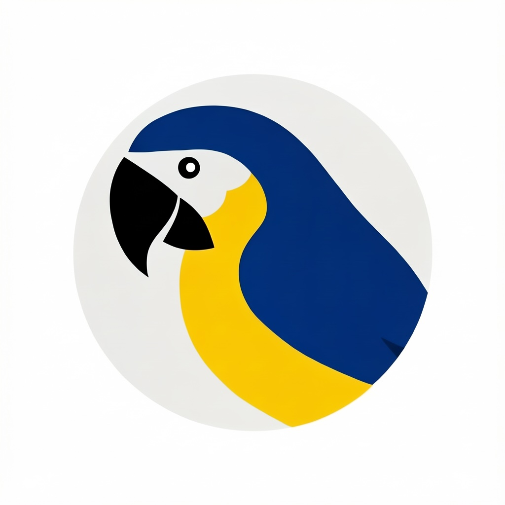
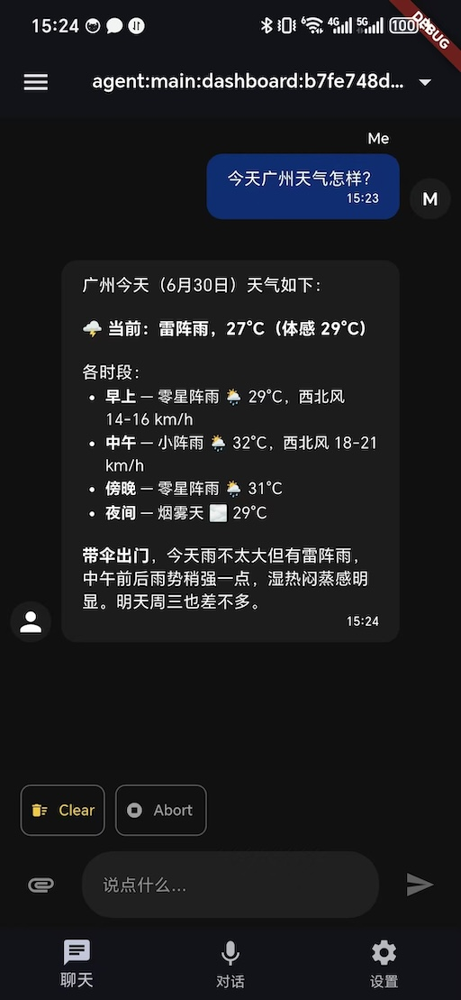

<p align="center">

</p>
<h1 align="center" style="margin: 30px 0 30px; font-weight: bold;">ParrotClaw 语鹦助手</h1>
<h4 align="center">为一人公司和内容设计师打造的AI数字员工</h4>
<p align="center">
 <a href="https://parrot.geetion.com"></a>
 <a href="https://gitee.com/alexcai/parrot_claw"></a>
 <a href="https://gitee.com/alexcai/parrot_claw/LICENSE"></a>
</p>

> 私有化部署 · 对话式交互
> 永久开源


## 演示图

<div align="center">
  
  &nbsp;&nbsp;&nbsp;
  
</div>

---

## 这是什么

**ParrotClaw** 是一个数字员工解决方案。

你只需要打开 App，像聊天一样告诉它你的需求，它就能帮你把活干了。

**覆盖的场景：**
- **会议记录助手** — 录音进去，纪要出来
- **知识问答助手** — 公司资料库，对话式检索
- **内容创作** — 文字、图片、视频、音频

👉 [关于 ParrotClaw](docs/docs/about.md)

> 📖 项目附带 VitePress 文档站，`cd docs && npm run docs:dev` 本地预览

---

## 快速开始

需要先安装 [Flutter](https://docs.flutter.dev/get-started/install)（`3.47.1`）。
```bash
git clone https://gitee.com/alexcai/parrot_claw.git
cd parrot_claw
flutter pub get
flutter run
```

---

## 使用示例

打开 App，在聊天界面说：

> "你好"

Agent 会回应你。从最简单的对话开始，然后你可以让它做更多事：

> "帮我把刚才的会议录音整理成纪要"

> "帮我写一篇文章发布到掘金"

> "帮我生成一张产品宣传图"

📖 更多完整场景教程（文章写作、会议记录、掘金发布、音视频处理、代码解读）见 [使用案例](docs/docs/use-cases.md)

---

## 架构

```
ParrotClaw App（Flutter 交互层）
         ↕
     OpenClaw（Agent 调度中枢）
         ↕
    ComfyUI / TTS / 其他工具
```

- **ParrotClaw App** — 交互层，集成离线语音识别（ASR）、数字人实时对话等
- **OpenClaw** — Agent 编排中枢，连接各工具链
- **工具链** — 图片生成、视频生成、音乐生成、语音合成、知识库等

---

## 当前版本

- App 版本：`1.0.3`
- Flutter SDK：`3.47.1`

## 路线图

- [x] 与 Agent 对话
- [x] 知识问答助手
- [x] 语音合成（TTS）
- [x] 数字人集成（Live2D）
- [x] 文生图 / 图生图
- [x] 音乐生成（AceStep 文生曲）
- [x] 会议记录助手（录音 → 纪要）
- [x] 开源到 GitHub
- [x] 配置 GitHub Actions
- [x] Windows 版本
- [ ] 扫码克隆服务器
- [ ] 编写英文 README
- [ ] 文生视频 / 图生视频
- [ ] 数字人案例
- [ ] FaceFusion 案例

---

## 技术栈

- **Flutter** — 跨平台 App（macOS / iOS / Android / Windows）
- **OpenClaw** — AI Agent 框架
- **ComfyUI** — 图像 / 视频生成 / 音乐生成
- **FFmpeg** — 视频处理 / 音频处理
- **Live2D / DUIX** — 数字人
- **Sherpa-onnx** — 离线语音识别

---

## 许可证

[MIT](LICENSE)

## 感恩集成

ParrotClaw 站在这些优秀开源项目的肩膀上，由衷感谢：

- [Flutter](https://github.com/flutter/flutter) — 跨平台 UI 框架
- [OpenClaw](https://github.com/openclaw/openclaw) — AI Agent 框架
- [ComfyUI](https://github.com/Comfy-Org/ComfyUI) — 图像 / 视频生成
- [sherpa-onnx](https://github.com/k2-fsa/sherpa-onnx) — 本地语音识别
- [FFmpeg](https://github.com/FFmpeg/FFmpeg) — 音视频处理

---

## 商业合作

QQ：121237385

Email: 121237385@qq.com

## 贡献

欢迎通过提交 [Pull Request](https://gitee.com/alexcai/parrot_claw/pulls) 参与项目。

贡献指南：[`docs/docs/contributing.md`](docs/docs/contributing.md)


## 附录

- [`docs/docs/use-cases.md`](docs/docs/use-cases.md) — 使用案例（文字创作、会议记录、掘金发布、音视频处理、代码解读）
- [`docs/docs/about.md`](docs/docs/about.md) — 关于项目与开发历程
- [`docs/docs/openclaw-setup.md`](docs/docs/openclaw-setup.md) — OpenClaw 安装、Gateway 连接等
- [`docs/docs/flutter-tips.md`](docs/docs/flutter-tips.md) — Flutter 项目架构、插件使用
- [`docs/docs/faq.md`](docs/docs/faq.md) — 常见问题
- [`docs/docs/contributing.md`](docs/docs/contributing.md) — 贡献指南
- [`docs/docs/getting-started.md`](docs/docs/getting-started.md) — 快速开始

---

*Made with Alexcai
